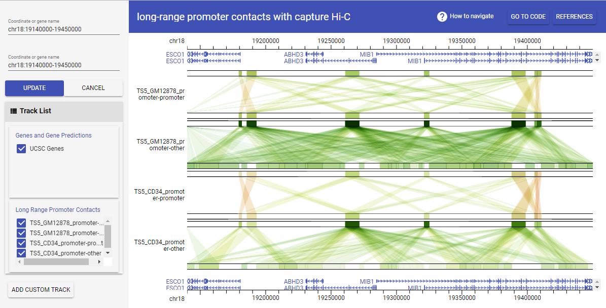

# [Long-range promoter contacts with capture Hi-C](https://chic.givengine.org/)
This genome browser demo presents 4 datasets of long-range genome interactions along with human genome assembly GRCh37 (hg19) for comparative studies. These datasets were generated from a ***Nature Genetics*** paper [Borbala Mifsud et al., *Nature Genetics* 47, 598-606 (2015)](http://www.nature.com/ng/journal/v47/n6/full/ng.3286.html). They used Capture Hi-C (CHi-C), an adapted genome conformation assay, to examine the long-range interactions of almost 22,000 promoters in 2 human blood cell types, GM12878 and CD34<sup>+</sup>. The promoter-promoter and promoter-other interactions were separated as different tracks in the genome browser.

 

## Data preparation for GIVE
The processed significant long-range promoter contacts data in that paper can be downloaded from [E-MTAB-2323 of ArrayExpress](http://www.ebi.ac.uk/arrayexpress/files/E-MTAB-2323/E-MTAB-2323.additional.1.zip). 

```bash
## run these commands in linux shell
wget http://www.ebi.ac.uk/arrayexpress/files/E-MTAB-2323/E-MTAB-2323.additional.1.zip
unzip E-MTAB-2323.additional.1.zip
```
After unzipping the downloaded file, we got four datasets, 
- `TS5_CD34_promoter-promoter_significant_interactions.txt`,  
- `TS5_GM12878_promoter-promoter_significant_interactions.txt`, 
- `TS5_CD34_promoter-other_significant_interactions.txt`,  
- `TS5_GM12878_promoter-other_significant_interactions.txt`. 

Following table shows the format of the datasets. Columns 1-3 and 7-9 show the coordinates of two genome regions with interactions. The last column can be treated as interaction score. These datasets are based on GRCh37 (hg19) human genome assembly.

|chr | start | end | Symbol | Ensembl Gene ID | expresssion quartile | chr | start | end | Symbol | Ensembl Gene ID | expresssion quartile | raw count | log(observed/expected)|
| --- | --- | --- | --- | --- | --- | --- | --- | --- | --- | --- | --- | --- | --- |
|chr5|140556909|140558389|PCDHB8-001|ENSG00000120322|2|chr5|140558467|140562101|PCDHB16-201|ENSG00000196963|2|338|16.7349171319745|
|chr3|183266196|183267882|KLHL6-AS1-001|ENSG00000242522|1|chr3|183269400|183277960|KLHL6-001|ENSG00000172578|5|249|16.4555995112416|
|chr6|26238741|26244133|HIST1H4F-201|ENSG00000198327|5|chr6|26244367|26249842|HIST1H4G-201|ENSG00000124578|1|443|16.2749178680534|

We need to convert the datasets to the GIVE supported interaction bed format (the format definition can be found in [GIVE Manual](https://github.com/Zhong-Lab-UCSD/Genomic-Interactive-Visualization-Engine/blob/master/manuals/3.1-GIVE-Toolbox-usages.md#6-add_track_interactionsh)). Using simple scripts [`chic2give.sh`](./chic2give.sh) and [`chic2give_directed.sh`](./chic2give_directed.sh), we can easily convert them to GIVE interaction bed files, which are named with a prefix `give_x_`. `chic2give_directed.sh` is used for promoter-other interactions to assign interaction direction using `dirFlag` column (see detail in [GIVE Manual](https://github.com/Zhong-Lab-UCSD/Genomic-Interactive-Visualization-Engine/blob/master/manuals/3.1-GIVE-Toolbox-usages.md#6-add_track_interactionsh)).

```bash
## run these commands in linux shell
# the first two command lines are used for undirected promoter-promoter interactions
bash chic2give.sh TS5_CD34_promoter-promoter_significant_interactions.txt ./
bash chic2give.sh TS5_GM12878_promoter-promoter_significant_interactions.txt ./

# following two command lines are used for directed promoter-other interactions
bash chic2give_directed.sh TS5_CD34_promoter-other_significant_interactions.txt ./
bash chic2give_directed.sh TS5_GM12878_promoter-other_significant_interactions.txt ./
```

Finally, we got four GIVE interaction bed files, 
- `give_x_TS5_CD34_promoter-promoter_significant_interactions.txt`, 
- `give_x_TS5_CD34_promoter-other_significant_interactions.txt`,
- `give_x_TS5_GM12878_promoter-promoter_significant_interactions.txt`,
- `give_x_TS5_GM12878_promoter-other_significant_interactions.txt`. 

The following table shows the GIVE interaction bed format. These datasets can be loaded to GIVE MySQL server. 

|ID|chrom|Start|End|linkID|value|dirFlag|
| --- | --- | --- | --- | --- | --- | --- |
|1|chr20|47889560|47895795|1|16.026310742063|0|
|2|chr20|47896527|47898203|1|16.026310742063|1|
|3|chr17|79827812|79838989|2|15.548584214411|0|
|4|chr17|79848037|79871266|2|15.548584214411|1|
|5|chr17|27046828|27048611|3|15.5357777367182|0|
|6|chr17|27048612|27049990|3|15.5357777367182|1|

## Build track in MariaDB
You need a server to build a genome browser with GIVE. Please read the [prerequisites and configuration of GIVE server](https://github.com/Zhong-Lab-UCSD/Genomic-Interactive-Visualization-Engine/blob/master/tutorials/2.2-custom-installation.md#prerequisites). In that tutorial page, you will also learn how to [prepare MariaDB database](https://github.com/Zhong-Lab-UCSD/Genomic-Interactive-Visualization-Engine/blob/master/tutorials/2.2-custom-installation.md#installing-give-server) and the GIVE Toolbox has information on how to [build a reference genome for GIVE](https://github.com/Zhong-Lab-UCSD/Genomic-Interactive-Visualization-Engine/blob/master/tutorials/3-GIVE-Toolbox.md#step-2-initialization-and-create-reference-genome). When you have prepared MariaDB and build a `hg19` database, you can use [`GIVE_chicTrack.sql`](./GIVE_chicTrack.sql) file and following command template to load all the datasets to MariaDB and build the tracks.

```bash
## run these commands in linux shell
# change `<your user name>` to your user name of MariaDB
mysql -u `<your user name>` -p <./GIVE_chicTrack.sql
```

## Build genome browser
When you have built tracks in MariaDB, it's very easy to build a genome browser. The following code is what we used to build our [demo](https://chic.givengine.org/). You can just copy and paste it in [jsfiddle](https://jsfiddle.net/) and then you can get the genome browser supported by our GIVE server. If you have built the tracks on your own GIVE server, you only need to replace the url in the code with your own server's url. 

```html
<!-- change the url to your own server path -->
<script src="https://www.givengine.org/libWC/webcomponents-lite.min.js"></script> 
<!-- change the url to your own server path-->
<link rel="import" href="https://www.givengine.org/lib/chart-controller/chart-controller.html">
<!-- Embed the browser in your web page -->
<chart-controller title-text="long-range promoter contacts with capture Hi-C" 
    ref="hg19" num-of-subs="2" 
    coordinate='["chr18:19140000-19450000", "chr18:19140000-19450000"]' 
    group-id-list='["genes", "CHi-C_promoter", "customTracks"]'>
</chart-controller>
```

You can read this [tutorial](https://github.com/Zhong-Lab-UCSD/Genomic-Interactive-Visualization-Engine/blob/master/tutorials/1.2-html-tweak.md) to learn how to simply tweak the genome browser. Our [demo](https://chic.givengine.org/) is based on the tweaked [`give_chic.html`](./give_chic.html) html file.
