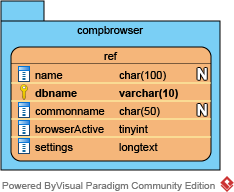

||||
| --- | --- | --- |
| [← 1.1. GIVE-Docker](0-annotation.md) | [↑ Index](Readme.md) | [2. Using GIVE Web Components →](2-webComponents.md) |

# Installation

## Table of Contents
*   [Introduction](#introduction)
*   [Prerequisites](#prerequisites)
    *   [Installing a Web Server](#installing-a-web-server)
    *   [Installing PHP](#installing-php)
    *   [Installing a MySQL-compatible Instance](#installing-a-mysql-compatible-instance)
*   [Installing GIVE Web Components](#installing-give-web-components)
*   [Installing GIVE Server](#installing-give-server)
    *   [Installing GIVE Server-side Components](#installing-give-server-side-components)
    *   [Installing GIVE Data Sources](#installing-give-data-sources)

## Introduction

***
*__NOTE:__ Installation of GIVE is optional and not required to use any of the Web Components of GIVE. By installing GIVE components, you can serve codes and/or data sources directly from your own server.*
***

GIVE consists of two major parts:
*   __GIVE Web Components__, the client-side codes running in browsers, implemented by HTML5;
*   __GIVE server__, this can be any server that is compatible with GIVE Web Components. The source code on GIVE repository, and the implementation on `give.genemo.org`, include two parts:
    *   __GIVE server-side component__, implemented by PHP
    *   __GIVE data sources__

## Prerequisites

### Installing a Web Server

To install any part of GIVE, a web-hosting environment is needed on your server. Please refer to the following information for how to install a web server on your OS:
*   [Apache Server](https://httpd.apache.org/docs/2.4/getting-started.html) (Windows and Linux supported, also [included in Mac OS](https://www.lifewire.com/use-your-mac-to-share-web-site-2260400))
*   [NGINX](https://www.nginx.com/resources/wiki/start/topics/tutorials/install/) (Windows and Linux supported, Mac OS support needs additional work)
*   [Internet Information Services (IIS)](https://www.iis.net/learn/get-started/getting-started-with-iis) (Included in Windows)
*   [Python `SimpleHTTPServer` module](https://docs.python.org/2/library/simplehttpserver.html) (Windows, Mac OS, Linux supported)

### Installing PHP

The server-side component of GIVE requires a functional PHP (7.0 or higher) web server with cURL support to work. Please refer to the following instructions to install PHP and cURL module to your web server:
*   [PHP installation and configuration](http://php.net/manual/en/install.php)
*   [cURL library](http://php.net/manual/en/book.curl.php)

### Installing a MySQL-compatible Instance

GIVE also needs a MySQL-compatible instance as a data source. Please refer to the following resources for installing your own MySQL instance:
*   [MySQL community server](https://dev.mysql.com/downloads/mysql/)
*   [MariaDB](https://downloads.mariadb.org/)

## Installing GIVE Web Components

Copy the contents of `/give/html` folder to a designated folder on your web server.

The URL to access your designated folder (including the trailing `/`) on your hosting environment will be referred to as __GIVE Web Components Path__ or __`web_components_path`__ (in code) throughout the manual and it will be needed when importing GIVE Web Components in your HTML pages.

> For example, if your server is accessible from `https://www.example.com/` and all files under `/give/html/` is copied to `/give_components` on your server (if you are using Apache in Linux, the folder may be `/var/www/html/give_components/`, for IIS in Windows, it may be `C:\wwwroot\give_components\`), then your __GIVE Web Components Path__ or __`web_components_path`__ will be:
> ```
> https://www.example.com/give_components/
> ```

***

*__NOTE:__ A public GIVE server is available at demo.give.genemo.org. If you wish to use GIVE Web Components hosted on the public server, please use `https://demo.give.genemo.org/` as your __`web_components_path`__*

***

## Installing GIVE Server

GIVE server consists of two parts: GIVE server-side component, which serves as interfaces between GIVE Web Components and the data sources, and the data sources themselves.

### Installing GIVE Server-side Components

Part of GIVE Server-side Components are already included in files under `/give/html/` and have been installed with GIVE Web Components. Please put the contents under `/give/includes/` somewhere on your server. The files under `/give/includes/` does not need to be directly accessed, however, __it will be easier if the relative path from `/give/html/givdata` to `/give/include` was kept the same.__

After installation, please edit `/give/html/components/bower_components/genemo-data-components/basic-func/constants.js` to indicate the server-side components' location:

<pre>
give.host = '<em><strong>&lt;web_components_path&gt;</strong></em>'
</pre>

### Installing GIVE Data Sources

To link the MySQL-compatible instance to the server-side component of GIVE, a database named `compbrowser` with a table named `ref` need to be created on the instance. The `ref` table is used to tell engine what references are available to be displayed and it needs at least the following columns:

| Column name | Type | Description |
| --- | --- | --- |
| `dbname` | `varchar` | The reference database name, only alphanumerics (`[0-9A-Za-z]`) and underscores (`_`) are allowed, *e.g.* `hg38`. <br> *__Note:__ this value will be used in the other tables/databases and be referred to as* __the reference database name__ *or* __`your_reference_database`__ *in the future.* |
| `name` | `varchar` | The formal name of the species, can be the Latin name, *e.g.* `Homo sapiens`. |
| `commonname` | `varchar` | The common name of the species, *e.g.* `human`. |
| `browserActive` | `tinyint` | Whether this reference is active for GIVE, use `1` to indicate it's active. |
| `settings` | `longtext` | Additional settings and tags related to the reference, this should be a string in JSON format. |

The following SQL code can be used to create a `ref` table in
a new `compbrowser` database.
```
CREATE TABLE `compbrowser`.`ref` (
  `dbname` varchar(30) NOT NULL DEFAULT '',
  `name` varchar(100) DEFAULT NULL,
  `commonname` varchar(50) DEFAULT NULL,
  `browserActive` tinyint(1) NOT NULL DEFAULT '0',
  `settings` longtext NOT NULL,
  PRIMARY KEY (`dbname`)
)
```

The data structure is illustrated as below:  


||||
| --- | --- | --- |
| [← 0. Annotations in the manual](0-annotation.md) | [↑ Index](index.md) | [2. Using GIVE Web Components →](2-webComponents.md) |
