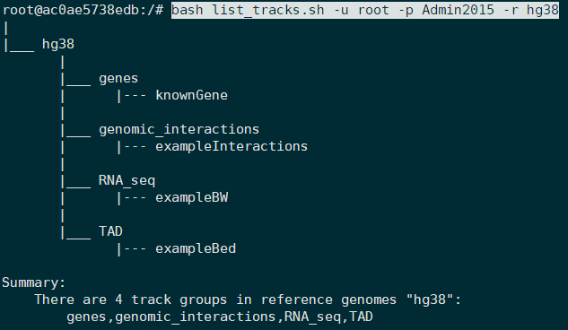
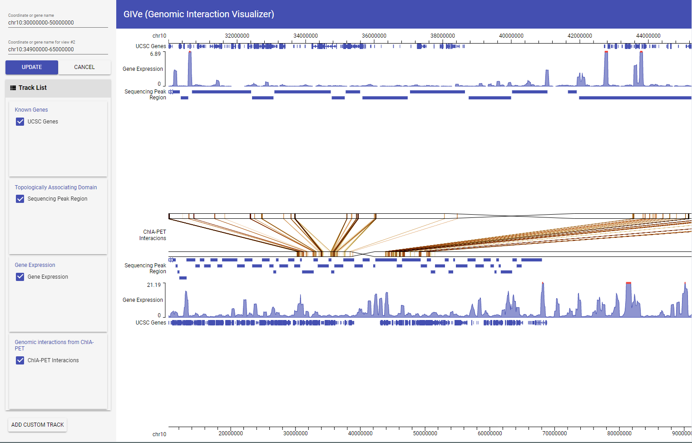

# GIVE Tutorial 3: Use GIVE-Toolbox to manage data tracks 

**Table of Contents**
---------
* [Introduction](#introduction)  
* [Walkthrough Example](#walkthrough-example)
    * [Step 1: Deployment of GIVE](#step-1-deployment-of-give)
    * [Step 2: Initialization and Create Reference Genome](#step-2-initialization-and-create-reference-genome) 
    * [Step 3: Create Track Groups](#step-3-create-track-groups)
    * [Step 4: Create Gene Annotation Track](#step-4-create-gene-annotation-track)
    * [Step 5: Create Data Track from bed File](#step-5-create-data-track-from-bed-file)
    * [Step 6: Create Data Track from bigWig File](#step-6-create-data-track-from-bigwig-file)
    * [Step 7: Create Data Track from interaction File](#step-7-create-data-track-from-interaction-file)
    * [List and Remove Data Tracks](#list-and-remove-data-tracks)
    * [Using The Customized GIVE Genome Browser](#using-the-customized-give-genome-browser)


## Introduction
The current version of GIVE needs MySQL for managing back end data source. It might be complicated for users who are not familiar with MySQL to build data tracks from their own data. So we integrated all the back end operations into a bundle of shell(bash) script tools, which is GIVE-Toolbox. GIVE-Toolbox greatly simplifies the operations for configuring and initializing data source, as well as building and managing data tracks. Here is a walk-through example, you will learn how to build a customized genome browser from zero just in 7 steps. It has never been easier!

If you would like to know the actual operations in MySQL, please refer to [GIVE manual 3.2: MySQL commands for managing data in GIVE data source](../manuals/3.2-dataSource.md).

GIVE support `UCSC gene table`, `bed`, `bigWig` and `interaction` format data tracks. Here are documents of the format definitions and related visualizing options in GIVE: 
- [`UCSC gene table` format](https://genome.ucsc.edu/cgi-bin/hgTables): knownGene annotation files can be download from UCSC Genome Browser (GENCODE track) 
- [`bed` Tracks](../manuals/4.1-bed.md)
- [`bigWig` Tracks](../manuals/4.2-bigwig.md)
- [`interaction` Tracks](../manuals/4.3-interaction.md)

The current version of GIVE-Toolbox includes 9 script tools. These tools can meet all the needs of configuring and managing GIVE data source. Please also read [manual 3.1 GIVE-Toolbox usages for managing data in GIVE data source](../manuals/3.1-GIVE-Toolbox-usages.md) for the detail of usage nad arguments of each script tool.

- `config_host.sh`: set configurations for GIVE service
- `initial_ref.sh`: initialize MySQL database structure and build reference genome database
- `add_track_geneAnnot.sh`: add gene annotation track from UCSC gene table file
- `add_trackGroup.sh`: add track group
- `add_track_bed.sh`: add data track from `bed` format data file
- `add_track_bigWig.sh`: add data track from `bigWig` format data file
- `add_track_interaction.sh`: add data track from `interaction` format data file
- `list_tracks.sh`: list the tree structure of whole GIVE data source or a specified track group, or detail settings of a specified data track
- `remove_data.sh`: remove a track, a track group (all the tracks in the track group will be removed) or a whole reference genome (all the track groups and tracks in the reference genome will be removed)

## Walkthrough Example

This walk-through example will show you how to use GIVE-Toolbox to easily build a customized GIVE genome browser. It includes 7 steps. In each step, you just need to run one or two bash command lines. All the data in the example can be found in the `example_data` folder.

For utilizing GIVE-Toolbox with [different GIVE deployment approaches](2-deploy.md):
- GIVE-Docker: GIVE-Toolbox is integrated in the GIVE-Docker. When you run a GIVE container and log into the container system (bash terminal), all the script tools can be directly executed with their names, which are located in system path `/usr/local/bin` (the container system). The `example_data` is in the `/tmp` path (the container system). 
- Custom installation: You need to clone the GIVE GitHub repository and install it correctly . `GIVE-Toolbox` folder is included in the cloned GIVE repo. You can use these tools with their directory like `bash ~/GIVE/GIVE-Toolbox/add_track_bed.sh -u ...`. For convenience, you can set all these tools excutable (using `chmod +x` command to them) and copy them to a system path folder (such as `/usr/local/bin` or declare some path in your `.bashrc` file). Then you can directly run these tools.

### Step 1: Deployment of GIVE
  
  First of all, you need to deploy GIVE on your local machine. You can use [GIVE-Docker](./2.1-GIVE-Docker.md) (recommended) or [custom install GIVE](./2.2-custom-installation.md).
  
  **TO ensure the consistency of system environment, this walk-through example is based on GIVE-Docker.** We can use only two command lines to deploy GIVE on your local machine using GIVE-Docker. Please learn how to use GIVE-Docker from [GIVE Tutorial 2.1: Easy local deployment of GIVE with GIVE-Docker](./2.1-GIVE-Docker.md). 
  
  ```bash
  # pull GIVE-Docker image from Docker-Hub
  docker pull zhonglab/give
  # run a GIVE container named as "give"
  docker run -d -it -p 40080:80 -p 40443:443 --name give zhonglab/give
  ```
  
  The following command lines will lead you to the internal of "give" container with a bash terminal. Then you can execute the commands of the step 2-7 in it. 
  
  ```bash
  # log into "give" container 
  docker exec -it give /bin/bash 
  ```
  
  If your host server is web accessible, then you can use GIVE genome browser remotely by setting the host domain name using `config_host.sh` tool. In this example, the domain of our server is "http://sysbio.ucsd.edu". As we are using GIVE-Docker container with HTTP port 40080 and HTTPS port 40443, so we need to set the domain name as "http://sysbio.ucsd.edu:40080" or "https://sysbio.ucsd.edu:40443".

  ```
  # set server domain name, if your local machine is web accessible
  bash config_host.sh -r /var/www/give -d "http://give.genemo.org:40080"
  ```
### Step 2: Initialization and Create Reference Genome

  There is already a built-in reference genome `hg19`. Hence, here we initialize a new genome reference `hg38`. Just one command is enough. It uses the cytoBandIdeo file of hg38 in the `/tmp/example_data` folder, which was downloaded from [UCSC genome annotation database](http://hgdownload.cse.ucsc.edu/goldenpath/hg38/database/).
  ```bash
  bash initial_ref.sh -u root -p Admin2015 -r hg38 -s "Homo sapiens" -c human  -f /tmp/example_data/cytoBandIdeo.txt
  ```
  Now you have a `hg38` reference genome. You can add data tracks on this reference genome.

### Step 3: Create Track Groups
  
  Every data track in GIVE needs to be assigned to a unique track group. The `add_trackGroup.sh` is designed for creating track group. The following command lines will create three track groups `genes`, `RNA_seq`, `TAD` and `genomic_interactions`. 
  ```
  bash add_trackGroup.sh  -u root -p Admin2015 -r hg38 -g "genes" -l "Known Genes" -o 1 -s 0
  bash add_trackGroup.sh  -u root -p Admin2015 -r hg38 -g "RNA_seq" -l "Gene Expression" -o 2 -s 0
  bash add_trackGroup.sh  -u root -p Admin2015 -r hg38 -g "TAD" -l "Topologically Associating Domain" -o 3 -s 0
  bash add_trackGroup.sh  -u root -p Admin2015 -r hg38 -g "genomic_interactions" -l "Genomic interactions from ChIA-PET" -o 3 -s 0
  ```
  Now you can add data tracks to these track groups.
### Step 4: Create Gene Annotation Track
  
  This command will create a data track named as `knownGene` from `knownGenes.txt` file. 
  ```
  bash add_geneAnnot.sh  -u root -p Admin2015 -r hg38 -t "knownGene" -g "genes" -l "UCSC known genes annotation" -s "UCSC Genes" -o 1 -v full  -f /tmp/example_data/knownGene.txt
  ```
  
### Step 5: Create Data Track from `bed` File

  This command will create a data track named as `exampleBed` in the `peak_region` track group from `example.bed` file. 

  ```
  bash add_track_bed.sh -u root -p Admin2015 -r hg38 -t exampleBed -g "TAD" -l "An example bed track from MACS calling peaks" -s "Sequencing Peak Region" -o 2 -v pack -f /tmp/example_data/example.bed
  ```
### Step 6: Create Data Track from `bigWig` File
  
  This command will create a data track named as `exampleBW` in the `RNA_seq` track group from `example.bigWig` file. 
  
  ```
  bash add_track_bigWig.sh -u root -p Admin2015 -r hg38 -t exampleBW -g "RNA_seq" -l "An example bigWig from single cell RNAseq" -s "Gene Expression" -o 3 -v full -a true -f /tmp/example_data/example.bigWig
  ```
  
### Step 7: Create Data Track from `interaction` File
  
  This command will create a data track named as `exampleInteractions` in the `genomic_interactions` track group from `example.interacion` file.
  
  ```
  bash add_track_interaction.sh -u root -p Admin2015 -r hg38 -t "exampleInteractions" -g "genomic_interactions" -l "An example genomic interactions from ChIA-PET data" -s "ChIA-PET Interactions" -o 1 -v full -q "0.37,1.32,1.78,2.19,2.60,2.97,3.43,3.85,4.34,4.90,5.48,6.16,6.94,8.01,9.05,10.41,12.37,14.88,19.84,31.77,290.17" -f /tmp/example_data/example.interaction
  ```

### List and Remove Data Tracks

  We also provide tools for listing and removing data tracks, which are `list_tracks.sh` and `remove_data.sh`. 

  With the following command, we can see the tree structure of all the data tracks in reference genome `hg38`.

  ```bash
  bash list_tracks.sh -u root -p Admin2015 -r hg38
  ```
  

  Using `remove_data.sh`, you can remove data track, group or the whole reference genome. The following command will remove the `TAD` track group. After removing, you can use `list_tracks.sh` to view the result.
  ```bash
  bash remove_data.sh -u root -p Admin2015 -r hg38 -g TAD
  ```

### Using The Customized GIVE Genome Browser

  Finally, in only 7 steps, you have built a full customized genome browser with 3 data tracks built from 3 kinds of supported data formats. You can use the genome browser with several lines of HTML code as below. 
  ```html
  <script src="bower_components/webcomponentsjs/webcomponents-lite.min.js"></script>
  <link rel="import" href="components/chart-controller/chart-controller.html">
  <chart-controller ref="hg38" num-of-subs="2"
    group-id-list='["genes", "TAD",  "RNA_seq", "genomic_interactions"]'
    default-track-id-list='["knownGene", "exampleBed", "exampleBW", "exampleInteractions"]'>
  </chart-controller>
  ```
  We have create the HTML file `example.html` in the `example_data` folder. You can copy it to `/var/www/give/html` folder in the "give" container. Then you can check it using URL [http://localhost:40080/example.html](http://localhost:40080/example.html).  
  If your local machine is web accessible, you can use the genome browser remotely. You can copy the following code into a html file and use it anywhere. The server domain name is "http://give.genemo.org:40080" in the example code, you need to replace it with your server settings.

  ```html
  <script   src="http://give.genemo.org:40080/bower_components/webcomponentsjs/webcomponents-lite.min.js"></script>
  <link   rel="import"href="http://give.genemo.org:40080/components/chart-controller/chart-controller.html">
  <chart-controller ref="hg38" num-of-subs="2"
    group-id-list='["genes", "TAD",  "RNA_seq", "genomic_interactions"]'
    default-track-id-list='["knownGene", "exampleBed", "exampleBW", "exampleInteractions"]'>
  </chart-controller>
  ```


