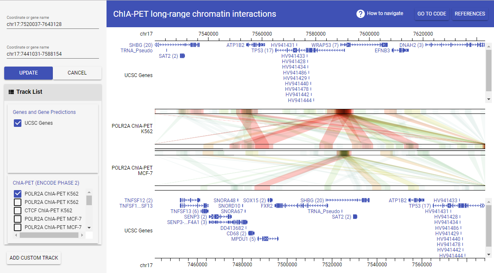

# GIVE Tutorial 3: Easy local deployment of GIVE with GIVE-Docker
The traditional way to deploy web service needs to install dependencies and configure environment at the operating system level. Although we already supplied a comprehensive manual for system-level [installation of GIVE](../manuals/1.2-system-level_installation.md), it's hard for users who lack experience in Linux administration to follow. Even for expert users, it's always annoying to do it. 
Here, we provide a modern approach to deploy GIVE, **GIVE-Docker**. We build GIVE-Docker based on [Docker container technology](https://www.docker.com/what-container). It's an operating-system-level virtualization technology, and it makes build, ship and deploy standardized software and web service much easier and more elegant without performance drop. Following this tutorial, you can set a completed genome browser on your computer in minutes. We recommend all users to use GIVE-Docker for deployment. 

## Description of GIVE-Docker image
The GIVE-Docker image is published on [DockerHub](https://hub.docker.com/r/zhonglab/give/). It's built on a [LAMP on Ubuntu container](https://hub.docker.com/r/linode/lamp/). Scripts for building GIVE-Docker can be found in our [GIVE-Docker GitHub Repo](https://github.com/Zhong-Lab-UCSD/GIVE-Docker). 
The GIVE-Docker image delivers an already configured GIVE with LAMP environment (Apache2, MySQL and PHP on Linux), and the data of [Demo2-ENCODE2_ChIA-PET](../gallery/Demo2-ENCODE2_ChIA-PET) in MySQL database. The configurations of GIVE-Docker are following the [installation manual of GIVE](../manuals/1.2-system-level_installation.md).

The `root` account passwd of MySQL is `Admin2015`.

## How to use GIVE-Docker?
### 4-steps to deploy GIVE
- **Install Docker CE**
  
  If Docker was not installed on your computer, please download and install [Docker CE]( https://www.docker.com/community-edition ). It's very easy to install and supports all the mainstream operating systems and cloud computing services, such as Mac OS, Windows 10, Ubuntu, AWS and AZURE. 
  After installation, you need to start the Docker service. For Windows and Mac OS users, just start the installed Docker software. For Linux users, you need to run the following command with root privileges. 
  ```
  service docker start
  ```
   
- **Pull GIVE-Docker from [Docker Hub](https://hub.docker.com/r/zhonglab/give/)**

  As we published GIVE-Docker on [Docker Hub](https://hub.docker.com/r/zhonglab/give/), so it's easy to pull GIVE-Docker with a command.
  ```
  docker pull zhonglab/give
  ```

- **Run GIVE-Docker container**

  Excute the following command, then a GIVE container named as `give` will run in background. 
  ```
  docker run -d -it -p 40080:80 -p 40443:443 -p 43306:3306 --name give zhonglab/give
  ```

- **Test the built-in [Demo2-ENCODE2_ChIA-PET](../gallery/Demo2-ENCODE2_ChIA-PET) genome browser**
  
  In the previous `docker run` command, `-p` options map three ports for communication between the operating system and GIVE container. With the mapping ports `40080 -> 80`(for http) and `40443 -> 443`(for https), we can use web browser to open the built-in Demo2-ENCODE2_ChIA-PET genome browser with following URLs (the https URL may encounter SSL certificate problem).
  
  [http://localhost:40080](http://localhost:40080)
  
  [https://localhost:40443](https://localhost:40443)
  
  


### Essential tips for adding data to GIVE container
After successfully deploying GIVE, you can utilize the power of GIVE to build your portable genome browser. You can learn how to customize your own genome browser in [GIVE Tutorial 1](1-knownCodeDataSource.md), and learn how to add your own data to GIVE MySQL database in [GIVE Tutorial 2](2-dataSource.md). 

Here, we give you some essential tips for adding data to GIVE container. You read [Docker official docs](https://docs.docker.com/get-started/) to learn more of Docker usage.
- Login to GIVE container

  You can login to the running GIVE container `give` as root and then do anything that you want. 
  ```
  docker exec -t -i give /bin/bash
  ```
  Alternatively, you can also directly login to the MySQL database of the container `give`.
  ```
  docker exec -t -i give mysql -uroot -p
  ```
  The passwd of MySQL `root` account is `Admin2015`.
- Transfer files
  
  You can transfer files between GIVE container and your operating system using `docker cp` command. The following commands are examples.
  ```
  # run GIVE-Docker container, named as give
  docker run -d -it -p 40080:80 -p 40443:443 -p 43306:3306 --name give zhonglab/give
  # copy file test.sh from OS to the container give
  docker cp ~/test.sh give:/tmp/test.sh
  # copy file from the container give to OS
  docker give:/tmp/test.sh ~/test.sh
  ```
- Stop, restart and remove running container
  
  You can use `docker ps -a` to check all the running and exited container. You can stop, restart and remove them. Keep in mind that all the changes made to the running container will lose after you stop it.
  ```
  docker stop give
  docker restart give
  docker rm give
  ```
- Backup data of GIVE container
    **Keep in mind that all the custom changes made to container do not affect the Docker image, so when you remove a container you will lose all the data.** So if you want to save data in the container, such as MySQL data, there are at least three approaches to do it. 
  - Use `docker commit` and `docker save` to save the whole container, and use `docker load` to restore it.
    
    ```
    docker commit -p give give-custom
    docker save -o ~/give-custom.tar give-custom
    docker load -i ~/give-custom.tar
    ```
  - Use **Docker Volume** `-v` option to assign a host dir for saving data when you start the container. For example, in the following command, the dir `/tmp/hostDir` will be mounted to the MySQL data dir in the GIVE-Docker container. All the changes you made to the MySQL databases in the container are saved in the host dir `/tmp/hostDir`.
    
    ```
    docker run -d -it -v /tmp/hostDir:/var/lib/mysql -p 40080:80 -p 40443:443 -p 43306:3306 --name give zhonglab/give
    ```
    
  - Use **Data Container**. Check [this tutorial](https://www.digitalocean.com/community/tutorials/how-to-share-data-between-docker-containers) to learn more.
